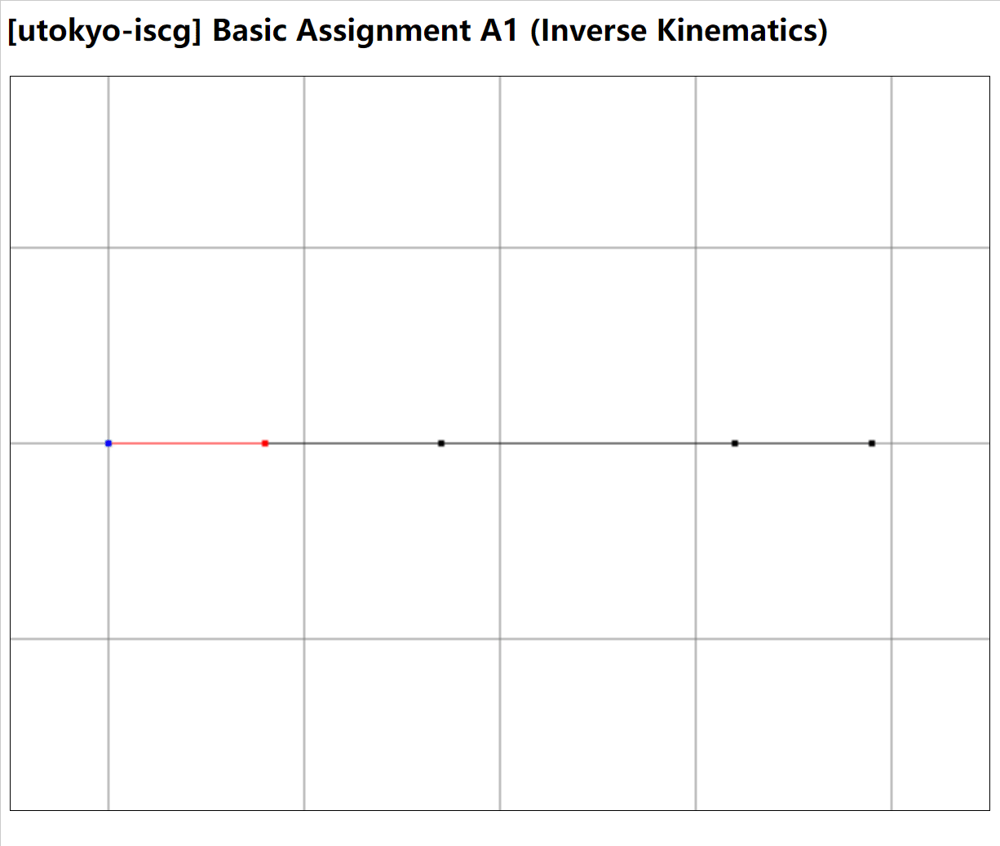

# WebGL_tasks

tasks for course of Computer Graphics in UTokyo

東京大学「コンピュータグラフィクス論」授業課題

### Modeling Basic Task1 ("Basic_M1")
Biezer surface     |  Coons patch
:-------------------------:|:-------------------------:
  |

### Animation Basic Task1 ("Basic_A1")

